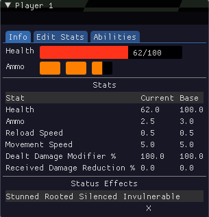
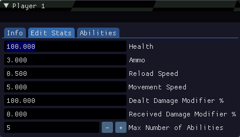
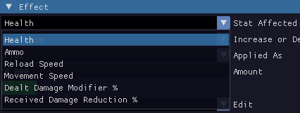
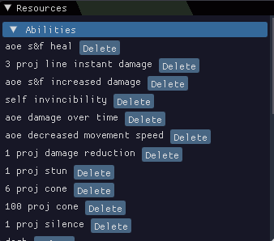
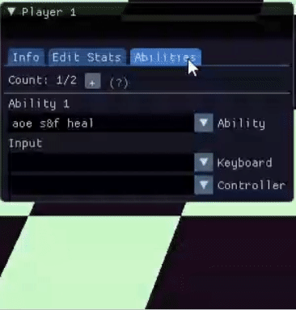
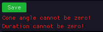
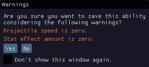
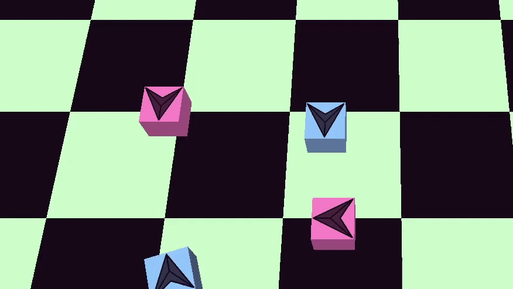
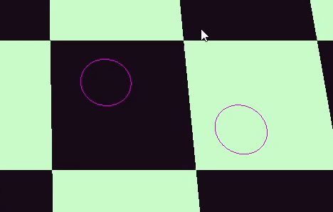

**Have you ever thought you found the best solution for your needs, just to realize later it was actually the opposite of that?** If you want to learn how to build an ability system from scratch, join me on my journey of figuring out what's wrong and what's right.

I am a second-year programmer at BUas Games, and over the past 6 weeks I have been working on a **tool that allows designers to create abilities modularly** in my C++ ECS-based custom engine for a top-down combat game.

Here is a sneak peek of the finished product:


This project is very valuable for me, as I am aiming to become a Gameplay Programmer, but I am also interested in tools - so for these reasons I will split this article into two sections: <a href="#part1">**Tools & UI**</a> and <a href="#part2">**Ability System**</a>.

Before starting I want to clarify some terminology and establish my code starting point - so what is an **ECS**? ECS stands for **Entity Component System** - instead of working with classes and inheritance like OOP (Object Oriented Programming), we use a DOD approach (Data Oriented Design). In the previous project I worked on, the goal was to build a game engine around this principle: entities that have components with data attached to them and the functionality is given by the systems - I will assume some basic knowledge of the concept moving forward. So that is my code starting point - my own custom engine made with the ECS library <a href="https://github.com/skypjack/entt">EnTT</a>.

Now that the structure of my engine is established, I can start talking about the main topic of discussion - the **ability creation tool**. I used the terms ability system and ability creation tool interchangeably, but in actuality they are separate components of the overall system. 

<h2 id="part1"><b> Part 1 - Tools & UI </b></h2>

In the starting video you can see a few types of abilities that my system supports - but how does one go about creating one? This is achieved through the user interface:


All of my menus are created using <a href="https://github.com/ocornut/imgui">ImGui</a>, more specifically all the dropdown menus are achieved through the `ImGui::Combo()` method, so that different settings can be selected from a set collection of options. These options are based off the **Ability Settings** and the **Player Stats Component**.

The Player Stats Component is mainly comprised of a set of attributes the player has, that abilities can alter:

```c++
struct PlayerStatsComponent
{
    int id = -1;
    int teamId = -1;

    float baseHealth = 50.0f;
    float currentHealth = baseHealth;

    float baseAmmo = 3.f;
    float currentAmmo = baseAmmo;

    float baseReloadSpeed = 0.5f;
    float currentReloadSpeed = baseReloadSpeed;

    float baseMovementSpeed = 5.0f;
    float currentMovementSpeed = baseMovementSpeed;

    float baseDealtDamageModifier = 1.f;
    float currentDealtDamageModifier = baseDealtDamageModifier;

    float baseReceivedDamageReduction = 1.f;
    float currentReceivedDamageReduction = baseReceivedDamageReduction;
    
    enum State : unsigned int
    {
        Stunned = 1 << 0,
        Rooted = 1 << 1,
        Silenced = 1 << 2,
        Invincible = 1 << 3,
        Dashing = 1 << 4,
    };

    unsigned state = 0;
};
```

Both current and base values are needed because we need a reference point - for example if you have a buff that increases the player's movement by `30%` `from 10 to 13`, how will you then undo that when the buff duration is over? Because if you decrease the same percentage from the current movement speed - `30% from 13` - you get `3.9`, which would result in `9.1` instead of `10`. That is why we need the base stat as well - to have a static reference point.

There is also the state which is a `bitmask` where the different states of the player can be active or not based on the flags. But this can all be understood better through the **Player Stats Window**, specifically the **Info Tab**: 




As well as giving the designer a way to edit the base stats of the player in-engine through the **Edit Tab**.

But how does one actually affect these stats through abilities? → It is one of the choices in the user interface - the **Stat Affected** drop-down menu:



Moving on you may ask "how do we translate the Player Stats Component's members into UI"? Well this is one of the weaknesses of my project - it is not straight-forward. In the **Ability Settings** I have `enum classes` for all the different aspects of an ability - in this case the Stat Affected:

```c++
enum class Stat
{
    Health = 0,
    Ammo,
    ReloadSpeed,
    MovementSpeed,
    DealtDamageModifier,
    ReceivedDamageReduction
};
```

But `ImGui` needs strings to be able to print out the options, so we also store an array of char pointers:

```c++
    const char* m_stats[6] = {"Health", "Ammo", "Reload Speed", "Movement Speed", "Dealt Damage Modifier %", "Received Damage Reduction %"};
    int m_statsSelectedItem = 0;
```

This is not ideal, as they all need to be kept in sync. Although it is not the optimal solution, sometimes we need to make this kind of choices for the project to progress. But let's not dwell on the bad, let's move on to the actual implementation of the abilities.

After the user creates a new ability we need a way to store it - that's where the **Ability Settings** come in! This is where all of the drop-down menus and inputs are saved:

```c++
struct AbilitySettings
{
    Target targetTeam = Target::Hostile;
    float aoeRadius = 0.f;
    int numberOfProjectiles = 1;
    float projectileRange = 0.f;
    float projectileRadius = 0.f;
    float projectileSpeed = 0.f;
    ProjectileShootType shootType = ProjectileShootType::Line;
    float spaceBetweenProjectiles = 0.f;
    float coneAngle = 0.f;
    CastType castType = CastType::Projectile;
    ApplyType applyType = ApplyType::Instant;
    InstantType instantType = InstantType::Effect;
    float dashSpeed = 0.f;
    StatusEffectType statusEffectType = StatusEffectType::Stun;
    Stat statAffected = Stat::Health; // stat affected!
    float statAffectAmount = 0.f;
    IncreaseOrDecrease increaseOrDecrease = IncreaseOrDecrease::Decrease;
    bool clampToMax = true;
    AppliedAs appliedAs = AppliedAs::Percentage;
    float durationAmount = 0.f;
    int numberOfTicks = 0;
    float aoeDuration = 0.2f;
};
```

Now these are a lot of variables, but bear with me! They each describe a different aspect of an ability - they will never all be used at the same time, but they still need to all be present to ensure homogenous storage of the abilities in the **Ability Manager**. The manager is just a glorified unordered map of ability names as keys, storing Ability Settings:

```c++
std::unordered_map<std::string, AbilitySettings> m_abilities;
```

That is also visualized in-engine through the Resource Viewer:



This way the user has a way of overviewing all of their created abilities, i addition to facilitating their potential deletion.

But how does one assign abilities to a player to use? That is where the **Player Stats Window** comes in again with the **Abilities Tab**:



Through this window, the user can assign different abilities, as well as specify input bindings for them. This window saves its data in the **Abilities On Player Component**:

```c++
struct AbilitiesOnPlayerComponent
{
    // ability name -> input for the ability (keyboard and controller)
    std::unordered_map<std::string, std::pair<std::optional<Input::KeyboardKey>,
    std::optional<Input::GamepadButton>>> abilityNamesToInputsMap;
    // optional because the input bindings
    // do not have a value until the user assigns one
    int maxNumberOfAbilities = 2;
};
```

I am storing an unordered map of strings as keys - the ability name - that have associated input bindings. If you remember in the **Ability Manager** we also use the ability names as keys, so this is how all the players retrieve the data for an ability, without any unnecessary memory duplication where each player stores that data for themselves - this way multiple players can use the same ability.

Coming back to the UI - these are quite a bit of menus and windows, for this reason I gave the user the option to turn each one off if they wish to. This is an overview of all of the UI:


Before moving on to the next section, I want to highlight that is important when creating a tool to make it easy to use right and hard to use wrong - for this reason I also have **errors and warnings** to notify the user of possible issues, since I believe that elevates the usability of any tool:




And that concludes the first section of my article - now we move on to the actual logic of the abilities!

<h2 id="part2"><b> Part 2 - The Ability System </b></h2>

You have seen the user side of things, but how does it all operate under the hood? I introduced you to some of the components of my project - now it is time to talk about how they all come together to bring abilities to life through the **systems**.

Besides all the other systems required for my engine to operate, I added two more systems for this project: the **Ability System** and the **Physics System**. I will start with the Ability System and diverge into the Physics System when I highlight its role for the abilities.

In my ECS architecture I have all my systems derived from a `Base System` class that override the `Update()` method and holds all the functionality of the system. This is the one for the **Ability System**:

```c++
void bee::AbilitySystem::Update(const float& dt)
{
    UpdateAmmoAndDisplayVisualEffects(dt);
    UpdateAbilities(dt);
    CheckInputToCreateAbilities();
    DisplayVisualEffectsEditor();
}
```


I split the functionality of the Ability System as much as possible into chunks that make sense on their own and that come together to create all the functionality that the abilities need. I will the relevant parts and explain what they do, also going into the functions they call in turn, but I will go in the order that makes the most sense to explain what my system does.

**Check Input To Create Abilities function**

Checks if the player is not in a state where they are not allowed to cast abilities (such as when they are stunned), and if that check passes, it iterates through all of the abilities of a player and their respective input bindings to create the abilities.

This is done through the **Create Ability** function - it creates a new entity emplacing the **Ability Component** on it, based on the **Ability Settings** retrieved from the **Ability Manager**. A lot of components play a role here, but the code may be easier to understand:

```c++
auto ability = m_registry.create();
auto& abilityComponent = m_registry.emplace<AbilityComponent>(ability, castByPlayer,
Engine.ResourceManager().GetAbilityManager().Get(abilityName).value());
```

And the **Ability Component** just holds the **Ability Settings** plus things like counters and other details that are specific to a deployed ability:

```c++
struct AbilityComponent
{
    entt::entity castByPlayer = entt::null;
    entt::entity hitPlayer = entt::null;
    AbilitySettings settings; // retrieved from the Ability Manager
    int currentNumberOfProjectiles = 1;
    float currentProjectileRange = 0.f;
    float currentDurationAmount = settings.durationAmount;
    int currentNumberOfTicks = settings.numberOfTicks;
    bool firstProjectileInLine = false;
    bool dead = false;
    float currentAoeDuration = settings.aoeDuration;
};
```

After the ability is created, the **Create Ability** function goes on to personalize the ability based on the different settings - for example if the ability affects the player that has cast it instantly, then it just applies the stat affect amount through the **Apply Amount** function (that I will come back to later) and then destroys it instantly. If the ability is for example a projectile, then the Create Ability function is also in charge of creating the **Physics Body** of that projectile, with its velocity and everything. So it creates different kinds of abilities based on the settings.

Because the **Check Input To Create Abilities** function is called after the **Update Abilities**, what happens next in execution is outside of the Ability System - in the **Physics System** to register collisions. I will come back later to the Physics System to talk about it.

So after having all the collisions registered we come back to the Ability System in the **Update Abilities** function. It is a lengthy method so I will provide pseudocode for it:

```c++
Function UpdateAbilities(dt: Float)
    // iterate over all the abilities
    for each entity with AbilityComponent in abilityView
        if dash // checks for dash settings
            // special case
            Decrease ability duration by dt
                if duration is over
                    Stop player's movement
                    Turn off dashing state
                    Destroy the ability entity

        // handle durational abilities
        else
            if player is hit
                Decrease ability duration by dt
                if duration is over
                    Apply effects based on ability type (instant, over time, buff/debuff, status effect)
                    Destroy ability if needed

        // handle cast abilities
        if not targeting self // all abilities that do not have self as the target are cast
            if ability is active and not dead // a projectile gets flagged as dead when it hits a target but the ability may still be active if it is a durational type
                for each collision with this ability
                    if collision is with a player
                        Apply ability effects based on ability type and target type
                        Handle additional logic for projectile and radius around player abilities
                        Destroy or modify ability components as needed

            // Additional logic for projectile and radius around player abilities
            if ability is a projectile
                Update projectile range
                Destroy projectile if max range reached or handle projectiles in line

            if ability is a radius around player
                Decrease AoE duration
                Destroy ability if duration is over

```

This is a very watered-down version of what the Update Abilities function does, but in essence it updates timers, applies effects and destroys abilities. The way effects are applied is through the **Apply Amount** function that I will also provide through pseudocode:

```c++
Function ApplyAmount(ability: AbilitySettings, hitPlayerStats: PlayerStatsComponent, castByPlayerStats: PlayerStatsComponent, revert: Boolean)
    // check if the hit player is invincible and the ability decreases stats
    if hitPlayer is invincible and ability is decreasing stats
        Exit function (do not apply any negative effects)

    // retrieve the respective affected stat
    [currentStatValue, baseStatValue] = GetStat(ability's affected stat, hitPlayerStats)

    // Calculate the amount by which the stat will be affected
    amount = ability's stat affect amount

    Perform calculations on the stat affect amount based on 
        different factors such as Dealt Damage Modifier

    // if it should have a decreasing effect
    if ability decreases stat
        Negate the amount

    // if this is called to revert the effects of a buff
    // after its duration is over
    if revert is true
        Negate the amount

    // finally apply the calculated amount to the current stat value
    currentStatValue += amount
    Clamp currentStatValue to be at least 0
```

There are a lot of calculations going on in this function to ensure the effect has the proper value and it is allowed to be applied (ex: the player is not invulnerable).



This concludes the logic of the **Ability System**. Next I want to talk about the **Physics System** and how I decided to implement it in my project.

The Physics System operates on the **Physics Body Component**:

```c++
struct PhysicsBody2DComponent
{
    glm::vec2 position = glm::vec2(0.f);
    glm::vec2 velocity = glm::vec2(0.f);
    float scale = 1.f; // radius of the circle (all physics bodies are disk shaped)

    std::vector<CollisionData> collisions = {};
    
    void Update(const float dt) // Clear collision data and update position based on velocity
};
```

The **Physics System** then updates the physics bodies and performs checks to update their collision data.

```c++
void bee::PhysicsSystem2D::Update(const float& dt)
{
    UpdateTransforms(dt);
    CheckAndRegisterCollisions();
    DebugDrawing();
}
```

I made my own simple 2D physics system that works great for my use case, but that was not the case from the beginning. This is where `the wrong way` part of the title comes in.

When I first started the project I knew my target is a 3D game, so I assumed I need a 3D physics system to support my project. So I started researching different 3D physics libraries, weighing different aspects to choose the best fit for my use case, until I eventually decided on <a href="https://github.com/jrouwe/JoltPhysics">Jolt Physics</a>. I spent half of my project integrating and using Jolt, considerably slowing down my progress due to its complexity. That was until I took a step back to assess the situation - I was causing more harm than good.

After rethinking my project I realized that I do not actually need 3D physics.The fact that I am using 3D graphics does not stop me from utilizing 2D physics, something that I did not realize from the beginning.

Now switching to a completely different physics system mid-project sounded scary, but I decided to not let myself be intimidated by change and go for it. I assessed the situation, and it looked like the time and effort required to make the change will be paid off in the long run - and in the end it did! I even decided to make my own 2D physics system instead of using an already existing library to ensure maximum suitability for my needs. For example, I do not need any collision resolution for my system, so I only have collision detection, or all my physics body shapes are circles/disks.



I will not go further in depth with the implementation of my physics system, since that is not the main focus, but I wanted to include this part to show that we shouldn't be afraid of admitting our mistakes and changing for the better!

To close off I would like to give credit to <a href="https://docs.unrealengine.com/5.0/en-US/gameplay-ability-system-component-and-gameplay-attributes-in-unreal-engine/">Unreal's Gameplay Ability System</a> for inspiring this project, even though it turned out very differently from the original reference point, as well as <a href="https://www.youtube.com/@BrawlStars">Brawl Stars</a>, the reference game this project is based on.

Overall this journey has taught me a lot about self-management and especially realizing that it's ok if things don't turn out as you expect them. Looking forward to keep building amazing things!


